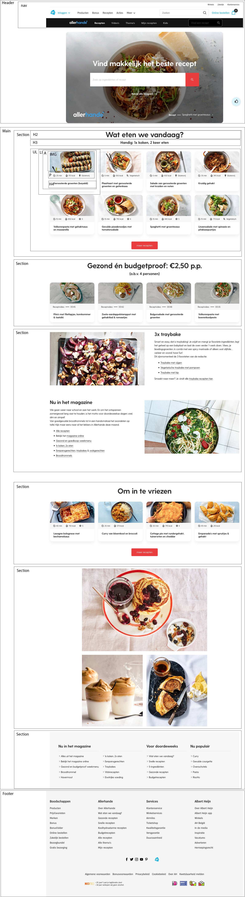

# Procesverslag
**Auteur:** 
Lisa Roelvink
500721227

Markdown cheat cheet: [Hulp bij het schrijven van Markdown](https://github.com/adam-p/markdown-here/wiki/Markdown-Cheatsheet). Nb. de standaardstructuur en de spartaanse opmaak zijn helemaal prima. Het gaat om de inhoud van je procesverslag. Besteedt de tijd voor pracht en praal aan je website.

---

## Bronnenlijst
1. https://www.ah.nl/allerhande/?gclid=Cj0KCQjwhb36BRCfARIsAKcXh6Fg7q8UiC2rwF_JHEVuwLrhW_cZlvSzljAW6-YcNlz-Yoi-KSvMiTgaAupyEALw_wcB&gclsrc=aw.ds
2. https://www.ah.nl/allerhande/recept/R-R1188376/papardelle-met-artisjok-en-warmgerookte-zalm
3. -...-

---

## Eindgesprek (week 7/8)

-dit ging goed & dit was lastig-

**Screenshot(s):**

-screenshot(s) van je eindresultaat-

---

## Voortgang 3 (week 6)

-same as voortgang 1-

---

## Voortgang 2 (week 5)

-same as voortgang 1-

---

## Voortgang 1 (week 3)

### Stand van zaken

-dit ging goed & dit was lastig-

**Screenshot(s):**

-screenshot(s) van hoe ver je bent-

### Agenda voor meeting

-samen met je groepje opstellen-

### Verslag van meeting

-na afloop snel uitkomsten vastleggen-

---

## Intake (week 1)

**Je startniveau:** 
Blauwe pieste _Ik vind code lastig. Ik oefen tot nu toe buiten de vakken niet vaak. Met hulp lukt het meestal wel._

**Je focus:** 
Focus op extra aandacht voor de surface plane, _voor nu_.

**Je opdracht:** 
[Dit is de website die ik ga maken](https://www.ah.nl/allerhande/?gclid=Cj0KCQjwhb36BRCfARIsAKcXh6GOptd02HzgCKzSHDhGJcwwlMw3VJhOGPReWlEySSeHiaI2LTAJmWsaAhacEALw_wcB&gclsrc=aw.ds)

[Dit is de detailpagina die ik ga maken](https://www.ah.nl/allerhande/recept/R-R1188376/papardelle-met-artisjok-en-warmgerookte-zalm)

Voor wanneer de inline-style link toch niet werkt: https://www.ah.nl/allerhande/?gclid=Cj0KCQjwhb36BRCfARIsAKcXh6GOptd02HzgCKzSHDhGJcwwlMw3VJhOGPReWlEySSeHiaI2LTAJmWsaAhacEALw_wcB&gclsrc=aw.ds

https://www.ah.nl/allerhande/recept/R-R1188376/papardelle-met-artisjok-en-warmgerookte-zalm

**Screenshot(s):**

**Breakdown-schets(en):**

---